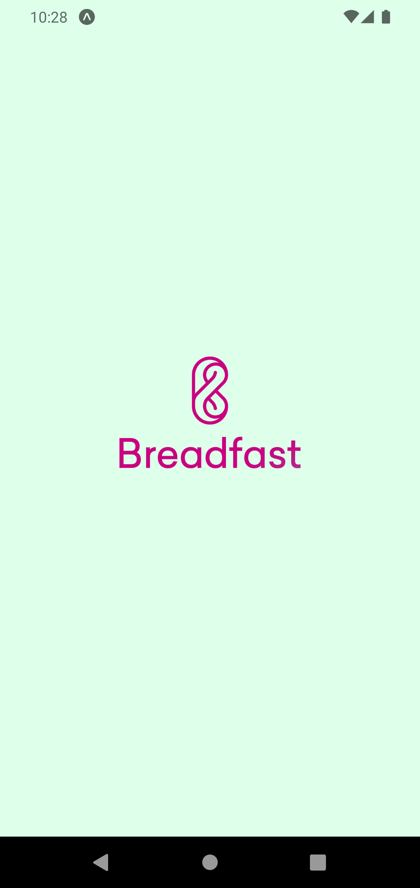
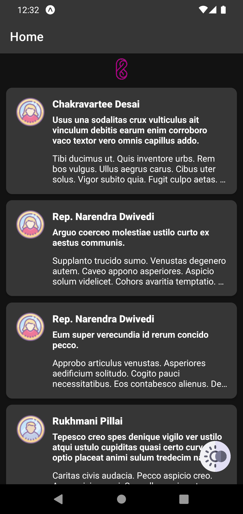
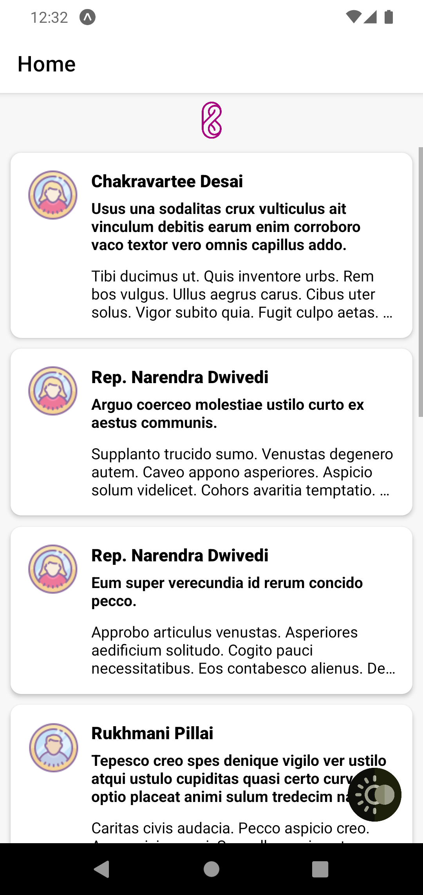
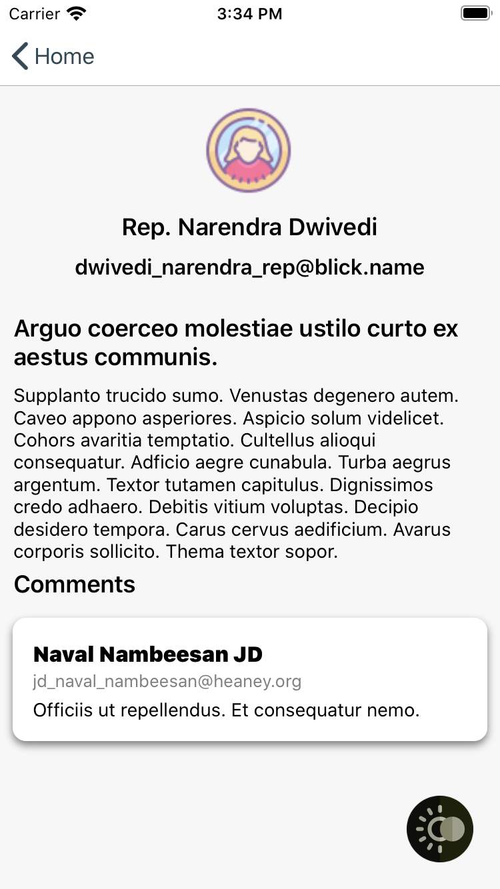
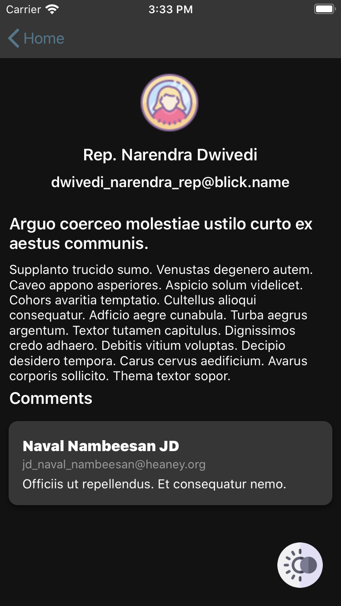
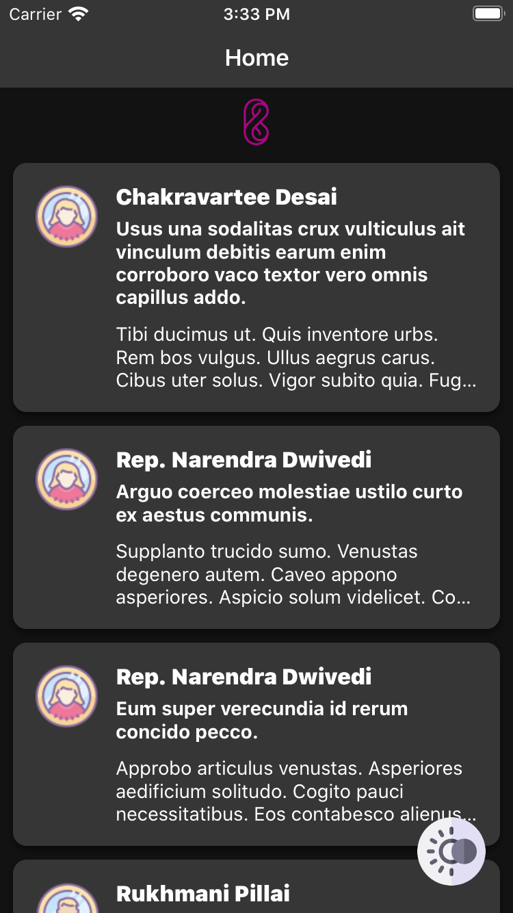
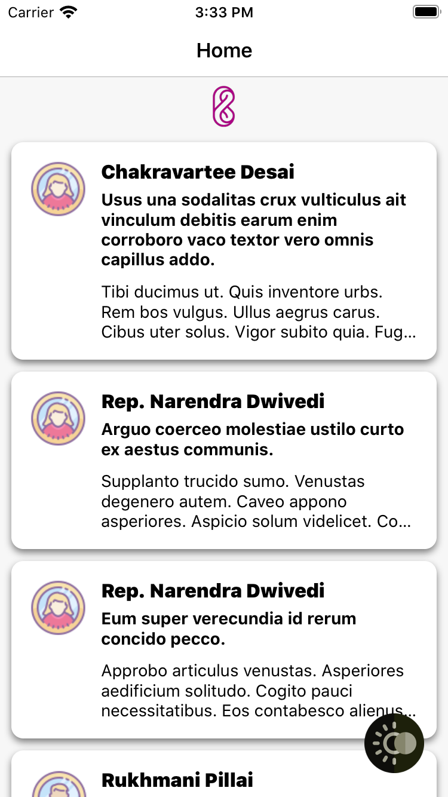

# BreadFast Demo

A React-native demo project using expo and Typescript.
dark mode is supported and can be toggled using the fab button on the right bottom of the app,and defaults to system default

<p>
  <!-- iOS -->
  
  <!-- Android -->
  
</p>

# Screenshots

### Splash



### Android

|  |  |
| ------------------------------------------------------ | ------------------------------------------------------ |
|  |  |

### iOs

|  |  |
| -------------------------------------------------- | -------------------------------------------------- |
|  |  |

## Run

installing expo cli

```sh
npm i -g expo-cli
```

```sh
yarn
```

#### Android

```sh
yarn run android
```

or download this [apk](https://expo.dev/artifacts/eas/i99XqbyKbecHspzw2jB911.apk)

#### iOs

```sh
yarn run ios
```

## Testing

Only a subset of the tests were implemented for post details screen.
to run tests

```sh
yarn run test
```

## Stack

- React native
- Expo
- react query
- graphql
- atomic design
